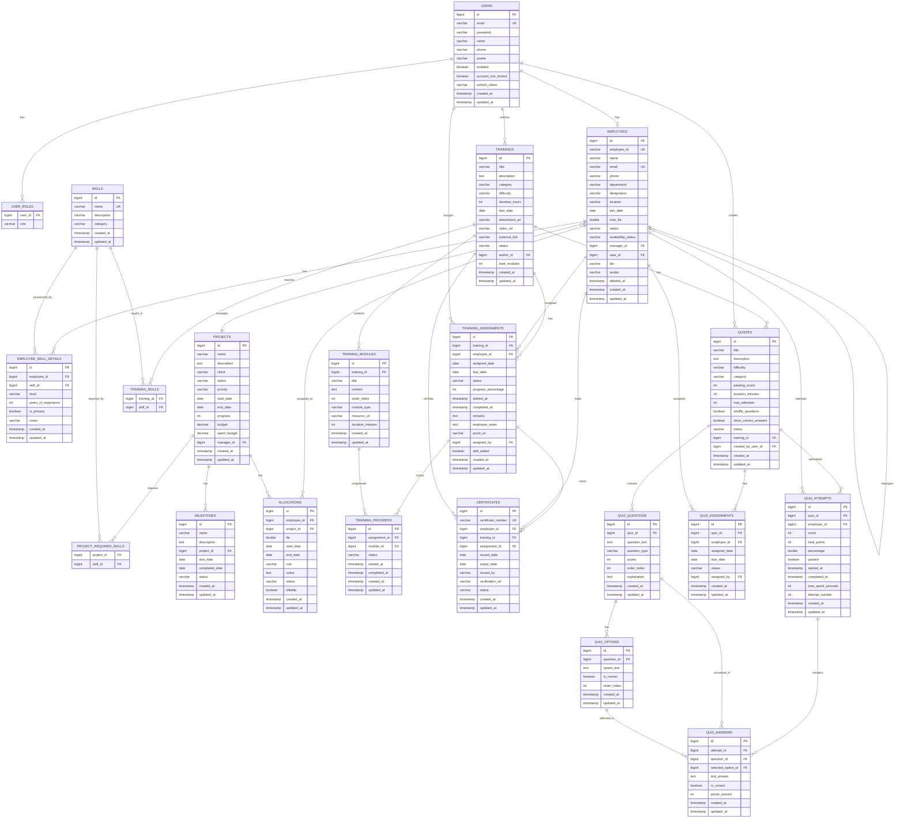

# Resource Management Portal - Entity Relationship Diagram

## Overview
This document describes the database schema and entity relationships for the Resource Management Portal (RMP).

---

## ER Diagram (Mermaid)



---

## Entity Descriptions

### Core Entities

#### Users
Authentication and authorization entity for system access.
- **Roles**: ADMIN, PM (Project Manager), HR, EMPLOYEE
- **Relationships**: One-to-One with Employee

#### Employees
Core resource entity representing team members.
- **Statuses**: ACTIVE, INACTIVE, ON_LEAVE, TERMINATED
- **Availability**: AVAILABLE, PARTIALLY_AVAILABLE, FULLY_ALLOCATED, ON_LEAVE, UNAVAILABLE
- **FTE**: Full-Time Equivalent (1.0 = 8 hours/day)
- **Self-referential**: Manager relationship

### Skills & Competencies

#### Skills
Master list of technical and soft skills.
- **Categories**: Technical, Soft Skills, Domain, etc.

#### EmployeeSkill (Junction)
Maps employees to their skills with proficiency levels.
- **Levels**: BEGINNER, INTERMEDIATE, ADVANCED, EXPERT
- Tracks years of experience and primary skill flag

### Projects & Allocations

#### Projects
Work items that require resource allocation.
- **Statuses**: NOT_STARTED, IN_PROGRESS, ON_HOLD, COMPLETED, CANCELLED
- **Priority**: LOW, MEDIUM, HIGH, CRITICAL
- Tracks budget, progress, and required skills

#### Allocations
Links employees to projects with time allocation.
- **FTE-based**: Uses Full-Time Equivalent (0.5 FTE = 4 hours/day)
- **Statuses**: ACTIVE, PENDING, COMPLETED, CANCELLED
- Tracks billable/non-billable time

#### Milestones
Project deliverables and checkpoints.
- **Statuses**: NOT_STARTED, IN_PROGRESS, COMPLETED, DELAYED

### Training & Development

#### Training
Learning content and courses.
- **Categories**: TECHNICAL, SOFT_SKILL, DOMAIN, COMPLIANCE, LEADERSHIP, CERTIFICATION, ONBOARDING
- **Difficulty**: BEGINNER, INTERMEDIATE, ADVANCED, EXPERT
- Contains modules and links to skills

#### TrainingAssignment
Assigns training to employees.
- Tracks progress, due dates, and completion status
- Links to certificates upon completion

#### TrainingModule
Individual learning units within a training.
- Ordered content with different types (video, document, quiz)

#### Certificate
Proof of training completion.
- Issued upon successful training completion
- Optional expiry date

### Quizzes & Assessments

#### Quiz
Assessment linked to training or standalone.
- Configurable passing score and time limits
- Supports multiple attempts

#### QuizQuestion
Individual questions in a quiz.
- **Types**: SINGLE_CHOICE, MULTIPLE_CHOICE, TRUE_FALSE, TEXT
- Ordered and weighted by points

#### QuizAttempt
Individual attempt at completing a quiz.
- Tracks score, time spent, and pass/fail status

---

## Relationship Summary

| Relationship | Type | Description |
|-------------|------|-------------|
| User ↔ Employee | 1:1 | Each user has one employee profile |
| Employee ↔ Manager | N:1 | Employees report to a manager |
| Employee ↔ Skills | M:N | Via EmployeeSkill junction |
| Employee ↔ Projects | M:N | Via Allocations |
| Project ↔ Skills | M:N | Required skills for project |
| Project → Milestones | 1:N | Project has milestones |
| Training → Modules | 1:N | Training contains modules |
| Training ↔ Skills | M:N | Training teaches skills |
| Employee ↔ Training | M:N | Via TrainingAssignment |
| TrainingAssignment → Certificate | 1:1 | Completion earns certificate |
| Quiz → Questions | 1:N | Quiz contains questions |
| Question → Options | 1:N | Question has options |
| Employee ↔ Quiz | M:N | Via QuizAssignment/Attempt |

---

## Database Statistics

| Entity | Table Name | Primary Features |
|--------|-----------|------------------|
| User | users | Authentication, Roles |
| Employee | employees | Resources, Skills, Allocations |
| Skill | skills | Competency tracking |
| Project | projects | Work management |
| Allocation | allocations | Resource assignment |
| Training | trainings | Learning management |
| Quiz | quizzes | Assessment system |
| Certificate | certificates | Credential management |

---

## Visual ER Diagram (Text-Based)

```
┌─────────────────────────────────────────────────────────────────────────────────────────┐
│                              RESOURCE MANAGEMENT PORTAL - ER DIAGRAM                      │
└─────────────────────────────────────────────────────────────────────────────────────────┘

                                    ┌──────────────┐
                                    │    USERS     │
                                    │──────────────│
                                    │ id (PK)      │
                                    │ email        │
                                    │ password     │
                                    │ name         │
                                    │ roles[]      │
                                    └──────┬───────┘
                                           │ 1:1
                                           ▼
┌──────────────┐     M:N      ┌──────────────────┐     M:N      ┌──────────────┐
│    SKILLS    │◄────────────►│    EMPLOYEES     │◄────────────►│   PROJECTS   │
│──────────────│              │──────────────────│              │──────────────│
│ id (PK)      │              │ id (PK)          │              │ id (PK)      │
│ name         │              │ employee_id      │              │ name         │
│ category     │              │ name             │              │ client       │
│ description  │              │ department       │              │ status       │
└──────┬───────┘              │ manager_id (FK)──┼──────┐       │ priority     │
       │                      │ max_fte          │      │       │ budget       │
       │                      └────────┬─────────┘      │       └──────┬───────┘
       │                               │                │              │
       │         ┌─────────────────────┼────────────────┘              │
       │         │                     │                               │
       ▼         ▼                     ▼                               ▼
┌──────────────────────┐     ┌─────────────────┐              ┌──────────────┐
│  EMPLOYEE_SKILLS     │     │   ALLOCATIONS   │              │  MILESTONES  │
│──────────────────────│     │─────────────────│              │──────────────│
│ employee_id (FK)     │     │ id (PK)         │              │ id (PK)      │
│ skill_id (FK)        │     │ employee_id (FK)│              │ project_id   │
│ level                │     │ project_id (FK) │              │ name         │
│ years_experience     │     │ fte             │              │ due_date     │
└──────────────────────┘     │ start_date      │              │ status       │
                             │ end_date        │              └──────────────┘
                             │ status          │
                             └─────────────────┘

┌─────────────────────────────────────────────────────────────────────────────────────────┐
│                                    TRAINING & QUIZ SYSTEM                                 │
└─────────────────────────────────────────────────────────────────────────────────────────┘

┌──────────────┐      1:N       ┌───────────────────┐      1:N       ┌──────────────┐
│  TRAININGS   │───────────────►│ TRAINING_MODULES  │                │  EMPLOYEES   │
│──────────────│                │───────────────────│                │──────────────│
│ id (PK)      │                │ id (PK)           │                │     ...      │
│ title        │                │ training_id (FK)  │                └──────┬───────┘
│ category     │                │ title             │                       │
│ difficulty   │                │ order_index       │                       │
│ duration     │                └───────────────────┘                       │
└──────┬───────┘                                                            │
       │                                                                    │
       │ 1:N              ┌───────────────────────┐                        │
       └─────────────────►│ TRAINING_ASSIGNMENTS  │◄───────────────────────┘
                          │───────────────────────│         M:N
                          │ id (PK)               │
                          │ training_id (FK)      │
                          │ employee_id (FK)      │────────┐
                          │ status                │        │
                          │ progress_percentage   │        │ 1:1
                          └───────────────────────┘        │
                                                           ▼
                                                  ┌──────────────────┐
                                                  │   CERTIFICATES   │
                                                  │──────────────────│
                                                  │ id (PK)          │
                                                  │ certificate_num  │
                                                  │ issued_date      │
                                                  │ expiry_date      │
                                                  └──────────────────┘

┌──────────────┐      1:N       ┌─────────────────┐      1:N       ┌──────────────┐
│   QUIZZES    │───────────────►│ QUIZ_QUESTIONS  │───────────────►│ QUIZ_OPTIONS │
│──────────────│                │─────────────────│                │──────────────│
│ id (PK)      │                │ id (PK)         │                │ id (PK)      │
│ title        │                │ quiz_id (FK)    │                │ question_id  │
│ passing_score│                │ question_text   │                │ option_text  │
│ duration_min │                │ question_type   │                │ is_correct   │
│ training_id  │                │ points          │                └──────────────┘
└──────┬───────┘                └─────────────────┘
       │
       │ 1:N
       ▼
┌─────────────────┐      1:N       ┌──────────────────┐
│  QUIZ_ATTEMPTS  │───────────────►│   QUIZ_ANSWERS   │
│─────────────────│                │──────────────────│
│ id (PK)         │                │ id (PK)          │
│ quiz_id (FK)    │                │ attempt_id (FK)  │
│ employee_id(FK) │                │ question_id (FK) │
│ score           │                │ selected_option  │
│ passed          │                │ is_correct       │
└─────────────────┘                └──────────────────┘
```

---

## Key Design Decisions

1. **FTE-based Allocation**: Uses Full-Time Equivalent instead of percentage for more accurate time tracking
2. **Soft Delete**: Employees use soft delete (deleted_at) to preserve historical data
3. **Audit Trail**: All entities extend BaseEntity with created_at, updated_at, created_by, updated_by
4. **Self-referential Manager**: Employee hierarchy through manager_id self-reference
5. **Junction Tables**: Many-to-many relationships use explicit junction tables for additional attributes
6. **Modular Training**: Training broken into modules for granular progress tracking
7. **Quiz Flexibility**: Quizzes can be standalone or linked to training

---

*Generated for RMP v1.0.0*


